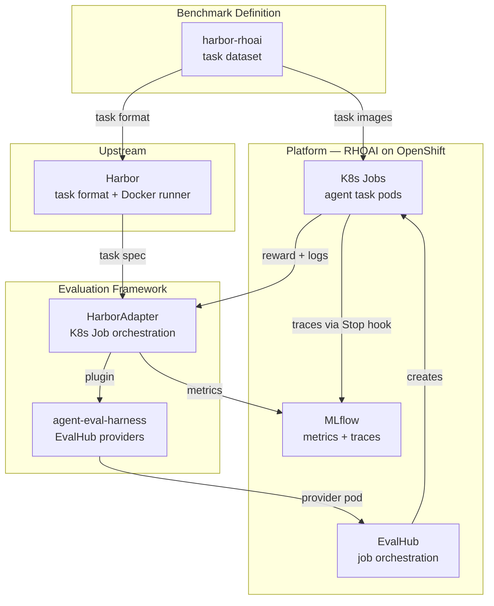

# Harbor Benchmark E2E Guide

## How It Fits Together



**Harbor** — open-source benchmark framework. Defines the task format (instruction + environment + tests + solution) and runs agents against tasks in Docker.

**harbor-rhoai** (this repo) — benchmark dataset. 3 tasks from real opendatahub-operator PRs, packaged in Harbor format, with tooling to build and run them on OpenShift.

**agent-eval-harness** — Red Hat evaluation framework (EvalHub). The HarborAdapter plugin runs Harbor tasks as K8s Jobs and collects results.

**RHOAI** — Red Hat OpenShift AI. Ships EvalHub and MLflow as managed components.

**MLflow** — metrics and experiment store. EvalHub writes benchmark scores; Claude Code writes execution traces. Single source of truth.

## Quickstart

### 1. Local Smoketest (Docker only, no cluster)

```bash
./smoketest.sh tasks/odh-operator-3290
```

Runs the oracle (known-good solution) against the task locally via Docker. Prints metrics to stdout. If `agent-eval-harness` is installed (`pip install -e ~/repos/agent-eval-harness`), also pushes results to MLflow.

### 2. Cluster Runs

```bash
# Set token (see "Cluster Setup" below for how to create this)
export HARBOR_TOKEN=$(oc get secret mlflow-claude-tracing-token -n evalhub \
  -o jsonpath='{.data.token}' | base64 -d)

# Build & push task images (first time or after changes)
docker login $(oc get route default-route -n openshift-image-registry \
  -o jsonpath='{.spec.host}') --username unused --password "$HARBOR_TOKEN"
./build-tasks.sh --push odh-operator-3290

# Oracle smoke-test (validates pipeline, ~3 min)
~/repos/.venv/bin/evalhub \
  --base-url https://evalhub-evalhub.apps.rosa.jeder-evalhub.uqi3.p3.openshiftapps.com \
  --token "$HARBOR_TOKEN" eval run --config evalhub-smoketest-job.yaml

# Agent run (~40 min, 2h timeout)
~/repos/.venv/bin/evalhub \
  --base-url https://evalhub-evalhub.apps.rosa.jeder-evalhub.uqi3.p3.openshiftapps.com \
  --token "$HARBOR_TOKEN" eval run --config evalhub-agent-job.yaml

# Monitor
oc get pods -n evalhub --watch

# Results — MLflow UI
# https://rh-ai.apps.rosa.jeder-evalhub.uqi3.p3.openshiftapps.com/mlflow/
# Experiment: harbor-rhoai → Runs (metrics) and Traces (agent execution)
```

## Complete E2E Sequence

```
PREREQUISITES
  1. Cluster setup complete (see below)
  2. HARBOR_TOKEN set from mlflow-claude-tracing SA

BUILD
  3. ./build-tasks.sh --push odh-operator-3290
     Builds 3 images per task: base (:latest), oracle (:oracle), agent (:agent)
       Base:   UBI9-minimal + Go 1.26 + repo at pre-PR commit
       Oracle: base + solution/solve.sh + tests/
       Agent:  base + Node.js + Claude Code CLI + Python 3.12 + mlflow + instruction.md + tests/
     All linux/amd64, pushed to internal registry

SUBMIT
  4. evalhub eval run --config evalhub-agent-job.yaml
     EvalHub creates provider pod (harbor-bench-provider image)
     Provider pod runs entrypoint.py which calls HarborAdapter._run_k8s()

EXECUTE
  5. Adapter creates K8s Job with agent task image
     Pod mounts gcp-vertex-sa secret (SA key file + env vars for Vertex AI)
     Pod injects claude-otel-config ConfigMap (MLflow tracing env vars)
  6. k8s_runner._agent_script() runs inside the pod:
     a. Creates $HOME/.claude/settings.json with MLflow Stop hook
     b. Runs: claude -p --dangerously-skip-permissions --model claude-sonnet-4-6
        "Read /app/instruction.md and implement the solution..."
     c. Claude Code reads instruction, explores codebase, implements solution,
        runs go test to verify, iterates until tests pass
  7. Claude Code exits, Stop hook fires:
     python3 mlflow.claude_code.hooks.stop_hook_handler()
     Reads session transcript, creates MLflow trace in harbor-rhoai experiment

VERIFY
  8. test.sh runs:
     a. go test on affected packages (regression + agent's new code)
     b. go test -list diffs against baseline-tests.txt (new test function check)
     c. Writes reward (0 or 1) to /logs/verifier/reward.txt
  9. Script emits HARBOR_REWARD=<value> to stdout

COLLECT
  10. Adapter polls K8s Job status until complete, reads pod logs
  11. Parses HARBOR_REWARD= line from stdout
  12. Logs test output as MLflow artifact on the run
  13. Creates EvaluationResult metrics (reward, duration, num_trials)
  14. EvalHub callbacks save metrics to MLflow experiment harbor-rhoai
  15. Adapter deletes the K8s Job (cleanup)

RESULT
  16. MLflow experiment harbor-rhoai contains:
      - Run with metrics: reward, duration_seconds, mean_reward, num_trials
      - Artifact: test_output.txt (full test results for debugging)
      - Trace with spans: claude_code interaction, LLM requests, tool/skill executions
```

## Skill & Tool Tracking

MLflow traces capture every tool and skill invocation from the Claude Code session. This enables A/B testing of skills across benchmark runs.

### What's captured

Each Claude Code tool call becomes a `TOOL` span in the MLflow trace:

| Span field | Content |
|------------|---------|
| `name` | `tool_Skill` (for skill calls), `tool_Bash`, `tool_Read`, etc. |
| `span_type` | `TOOL` |
| `inputs` | `{"skill": "<skill-name>", "args": "..."}` for Skill calls |
| `outputs` | `{"result": "..."}` — success output or error message |
| `start_time_ms` / `end_time_ms` | Execution timing |

Skill call failures (skill not found, execution errors) appear as error messages in the span's `outputs.result` field.

### Querying traces for A/B testing

```bash
# Get traces for a run
TRACE_ID=<from MLflow UI or API>
curl -sk -H "Authorization: Bearer $HARBOR_TOKEN" -H "x-mlflow-workspace: evalhub" \
  "https://rh-ai.apps.rosa.jeder-evalhub.uqi3.p3.openshiftapps.com/mlflow/ajax-api/2.0/mlflow/traces/$TRACE_ID/spans"
```

To compare skill usage across runs:
- Count `TOOL` spans where `name = "tool_Skill"` → skill invocation frequency
- Filter by `inputs.skill` → specific skill usage
- Check `outputs.result` for errors → skill failure rate
- Compare `end_time_ms - start_time_ms` → skill execution time

### Key fields for A/B testing

| Metric | How to extract |
|--------|---------------|
| Skill call count | Count spans with `name = "tool_Skill"` |
| Which skills used | `span.inputs.skill` |
| Skill failures | `span.outputs.result` contains error text |
| Tool call misses | Spans where tool was invoked but returned "not found" |
| Token usage | Root span metadata `mlflow.trace.tokenUsage` |
| Total duration | Root span `end_time_ms - start_time_ms` |

## Cluster Setup (One-Time)

Steps to set up a fresh cluster for Harbor benchmarks. All commands assume `oc` is logged in as cluster admin.

### 1. Create evalhub namespace

```bash
oc new-project evalhub
```

### 2. Create ServiceAccount and token

```bash
oc create sa mlflow-claude-tracing -n evalhub

oc create secret generic mlflow-claude-tracing-token -n evalhub \
  --type=kubernetes.io/service-account-token \
  --from-literal=kubernetes.io/service-account.name=mlflow-claude-tracing

# Annotate the secret to bind it to the SA
oc annotate secret mlflow-claude-tracing-token -n evalhub \
  kubernetes.io/service-account.name=mlflow-claude-tracing
```

### 3. Grant RBAC

```bash
# Job creation, pod/log access in evalhub namespace
oc create role harbor-job-creator -n evalhub \
  --verb=create,get,list,watch,delete \
  --resource=jobs,pods,pods/log

oc create rolebinding harbor-job-creator -n evalhub \
  --role=harbor-job-creator \
  --serviceaccount=evalhub:mlflow-claude-tracing

# EvalHub API access
oc adm policy add-role-to-user edit \
  system:serviceaccount:evalhub:mlflow-claude-tracing -n evalhub

# MLflow access
oc create clusterrolebinding harbor-mlflow-access \
  --clusterrole=trustyai-service-operator-evalhub-mlflow-access \
  --serviceaccount=evalhub:mlflow-claude-tracing
```

### 4. Security — anyuid SCC

Task images run as root (Go build cache, git operations).

```bash
oc adm policy add-scc-to-user anyuid -z default -n evalhub
```

### 5. Create Vertex AI credentials secret

```bash
# Replace with your GCP OAuth2 credential file
oc create secret generic gcp-vertex-sa -n evalhub \
  --from-file=sa-key.json=<path-to-gcp-credentials.json> \
  --from-literal=CLAUDE_CODE_USE_VERTEX=1 \
  --from-literal=ANTHROPIC_VERTEX_PROJECT_ID=<gcp-project-id> \
  --from-literal=CLOUD_ML_REGION=us-east5 \
  --from-literal=GOOGLE_APPLICATION_CREDENTIALS=/secrets/gcp/sa-key.json
```

### 6. Create MLflow tracing ConfigMap

```bash
MLFLOW_TOKEN=$(oc get secret mlflow-claude-tracing-token -n evalhub \
  -o jsonpath='{.data.token}' | base64 -d)

oc create configmap claude-otel-config -n evalhub \
  --from-literal=CLAUDE_CODE_ENABLE_TELEMETRY=1 \
  --from-literal=MLFLOW_CLAUDE_TRACING_ENABLED=true \
  --from-literal=MLFLOW_TRACKING_URI=https://mlflow-direct.<cluster-apps-domain> \
  --from-literal=MLFLOW_EXPERIMENT_NAME=harbor-rhoai \
  --from-literal=MLFLOW_WORKSPACE=evalhub \
  --from-literal=MLFLOW_TRACKING_TOKEN="$MLFLOW_TOKEN"
```

### 7. Register harbor-bench provider

```bash
# Apply provider ConfigMap
oc apply -f deploy/harbor/configmap-template.yaml

# Add provider to EvalHub CR
oc patch evalhub evalhub -n evalhub --type=json \
  -p '[{"op":"add","path":"/spec/providers/-","value":"harbor-bench"}]'
```

### 8. Kyverno policies

EvalHub EA2 hardcodes an unqualified sidecar image. Apply the rewrite policy:

```bash
# See deploy/kyverno/ for policy manifests (TODO: create these)
# Current workaround: manually created ClusterPolicy rewrite-eval-runtime-sidecar
```

### 9. Extract HARBOR_TOKEN

```bash
export HARBOR_TOKEN=$(oc get secret mlflow-claude-tracing-token -n evalhub \
  -o jsonpath='{.data.token}' | base64 -d)
```

## Cluster Resources Reference

| Resource | Namespace | Purpose |
|----------|-----------|---------|
| SA `mlflow-claude-tracing` | evalhub | Automation identity for jobs, registry, MLflow |
| Secret `mlflow-claude-tracing-token` | evalhub | Long-lived SA token |
| Secret `gcp-vertex-sa` | evalhub | Vertex AI OAuth2 creds + env vars |
| ConfigMap `claude-otel-config` | evalhub | MLflow tracing config for Claude Code |
| ConfigMap `evalhub-provider-harbor-bench` | redhat-ods-applications | Provider spec |
| Role `harbor-job-creator` | evalhub | RBAC for job/pod operations |
| ClusterPolicy `rewrite-eval-runtime-sidecar` | cluster | Kyverno workaround for EvalHub EA2 |
| SCC `anyuid` | evalhub | Task images need root for Go build |
