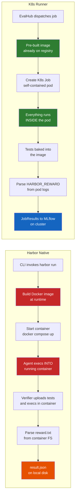

# Execution Flow Comparison: Harbor Native vs K8s Runner

## Flow 1: Harbor Native (Docker)

```mermaid
sequenceDiagram
    participant CLI as harbor run
    participant Job as Job
    participant Trial as Trial
    participant Env as DockerEnvironment
    participant Container as Docker Container
    participant Agent as Agent
    participant Verifier as Verifier

    CLI->>Job: run(-p tasks/foo -a oracle)
    Job->>Job: resolve task config (task.toml)
    Job->>Trial: create trial queue

    rect rgb(40, 40, 60)
        Note over Trial,Container: Environment Setup
        Trial->>Env: start(force_build)
        Env->>Env: docker compose build (Dockerfile)
        Env->>Container: docker compose up --detach
        Env->>Container: healthcheck
    end

    rect rgb(40, 60, 40)
        Note over Trial,Agent: Agent Execution
        Trial->>Agent: setup(environment)
        Trial->>Agent: run(instruction, environment)
        Agent->>Container: commands via docker compose exec
        Note right of Agent: Agent reads instruction.md,<br/>writes code in container
    end

    rect rgb(60, 40, 40)
        Note over Trial,Verifier: Verification
        Trial->>Verifier: verify()
        Verifier->>Container: upload /tests/
        Verifier->>Container: bash /tests/test.sh
        Container-->>Verifier: reward.txt, test output
        Verifier-->>Trial: rewards dict
    end

    Trial->>Trial: download artifacts
    Trial->>Container: stop and remove
    Trial-->>Job: result.json
    Job-->>CLI: job result.json + metrics
```

## Flow 2: EvalHub + K8s Runner (Our Solution)

```mermaid
sequenceDiagram
    participant CLI as evalhub eval run
    participant EvalHub as EvalHub Server
    participant Provider as Provider Pod
    participant Adapter as HarborAdapter
    participant Runner as k8s_runner
    participant K8sAPI as K8s API
    participant TaskPod as Task Pod (Job)
    participant MLflow as MLflow

    CLI->>EvalHub: --config job.yaml
    EvalHub->>Provider: create provider pod (2 containers)

    rect rgb(40, 40, 60)
        Note over Adapter,Runner: Adapter Dispatch
        Provider->>Adapter: run_benchmark_job(config)
        Adapter->>Adapter: extract params (agent, image, secrets)
        Adapter->>Runner: run_task_job(image, agent, secret_volumes)
    end

    rect rgb(40, 60, 40)
        Note over Runner,TaskPod: K8s Job Execution
        Runner->>K8sAPI: create Job manifest
        Note right of Runner: Image is PRE-BUILT<br/>(no Docker build at runtime)
        K8sAPI->>TaskPod: schedule pod

        alt agent == oracle
            TaskPod->>TaskPod: bash /solution/solve.sh
        else agent == claude-code
            TaskPod->>TaskPod: claude -p "Read instruction.md..."
        end
        TaskPod->>TaskPod: bash /tests/test.sh
        TaskPod->>TaskPod: write HARBOR_REWARD to stdout
    end

    rect rgb(60, 40, 40)
        Note over Runner,TaskPod: Result Collection
        Runner->>K8sAPI: poll job status (5s interval)
        K8sAPI-->>Runner: succeeded or failed
        Runner->>K8sAPI: read pod logs
        K8sAPI-->>Runner: stdout with HARBOR_REWARD line
        Runner->>K8sAPI: delete job (cleanup)
    end

    Runner-->>Adapter: reward, stdout, duration_s, exit_code
    Adapter->>Adapter: map to EvalHub JobResults

    rect rgb(50, 40, 50)
        Note over Provider,MLflow: MLflow Persistence
        Provider->>MLflow: callbacks.report_results()
        MLflow->>MLflow: log metrics, params, artifacts
    end
```

## Key Differences

## Architecture Trade-offs

| Aspect | Harbor Native | K8s Runner |
|--------|--------------|------------|
| Image build | At runtime (slow) | Pre-built and pushed (fast at run time) |
| Agent interaction | Exec into running container | Self-contained in pod |
| Test delivery | Uploaded by verifier at runtime | Baked into image |
| Result extraction | Parse files from container FS | Parse stdout from pod logs |
| Orchestration | Harbor Job/Trial/Environment | K8s Job + polling loop |
| Isolation | Docker container on host | K8s pod (namespace, RBAC, quotas) |
| Scalability | Single host, docker compose | Cluster-native, schedulable |
| Dependencies | Docker daemon on host | K8s API access only |
| MLflow | Not built-in | Via EvalHub sidecar |
